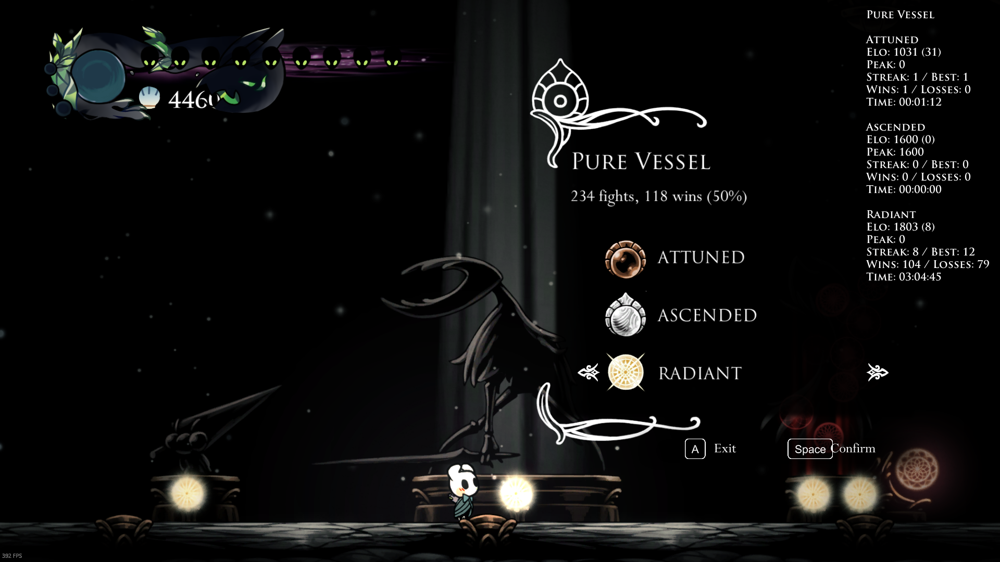
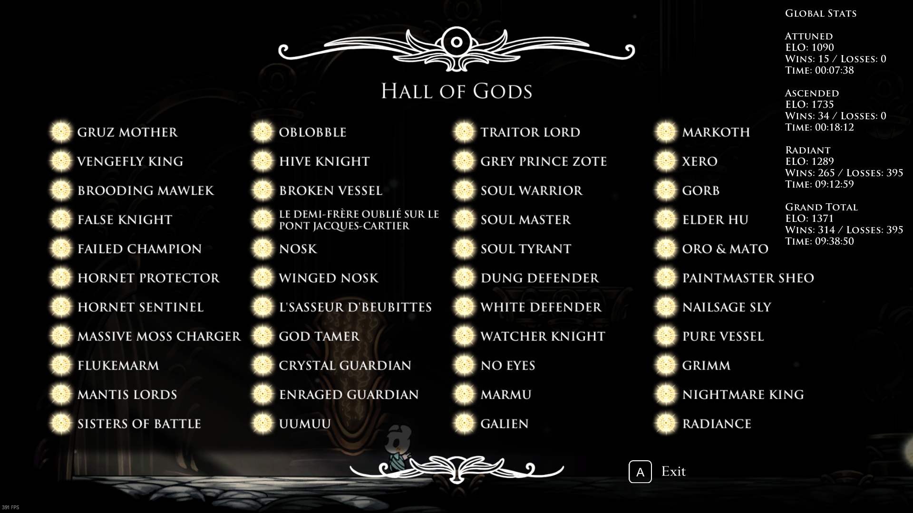
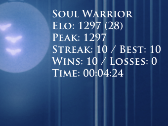

# Godhome Elo Counter

_A Hollow Knight mod that introduces an ELO rating system to Godhome, enhancing your gameplay experience by tracking performance and encouraging improvement._

## 📈 Why Use ELO Instead of Just Tracking Wins/Losses?

ELO offers a more dynamic and responsive metric compared to winrate. Unlike winrate, which can be heavily influenced by past losses and becomes harder to improve over time, ELO adjusts based on your current performance:

- **Rapid Progression:** If you play well, your ELO increases quickly.
- **High Stakes:** As your ELO rises, gains become harder to achieve, and losses have a greater impact.

ELO reflects your _current skill level_ and adjusts to your performance, making it a more accurate and rewarding system for tracking improvement.

## 🎯 Benefits of Using ELO

### 🔁 Consistency

Striving for a high ELO demands consistent performance. It encourages you to approach each fight with focus and determination, even during training. No more shrugging off mistakes as "just a fluke"—every match matters.

### 🧠 Self-Control

Challenges in Hollow Knight can be intense. With ELO, every win and loss affects your rating. This adds pressure, pushing you to master self-control and thrive under difficult conditions, skills that are invaluable in real gameplay.

## 🌟 Features

- **Detailed Performance Stats:**
  - ELO, peak ELO, ELO gains/losses
  - Win/loss records, streaks, time spent
  - Per-boss and per-difficulty tracking
  - History of the last 8 rounds
- **Customizable Overlays:**
  - Toggle stats visibility during fights or in the Hall of Gods (HoG)
  - Tailor the display to your preferences
- **Global Leaderboard:**
  - View cumulative stats on the HoG Board.
- **Comprehensive Configuration Options:**
  - Set a starting ELO (up to 1600, equivalent to ~50% winrate).
  - Reset ELO for specific bosses or all bosses without affecting other stats.
  - Customize the UI for a streamlined experience.

## ⚙️ Configuration

Access the mod's settings via the in-game mod menu. Here's what you can adjust:

- **Base ELO:** Set your starting ELO. The maximum is 1600 (approximately a 50% winrate).
- **UI Customization:** Enable or disable specific stats in the overlay to match your preferences.
- **Hide UI:**
  - During fights for a distraction-free experience.
  - In the HoG for a cleaner look.
- **ELO Resets:** Reset ELO for all bosses or only the current one.

## 🖼️ Screenshots

### 📌 Boss Statue

### 📌 Hall of Gods Board

### 📌 In-Fight Overlay

## 🛠️ Dependencies

To use this mod, you'll need the following dependencies installed:

- [MagicUI](https://github.com/BadMagic100/MagicUI): A UI toolkit for Hollow Knight mods.
- [Satchel](https://github.com/PrashantMohta/Satchel): A library for mod configuration and data management.
